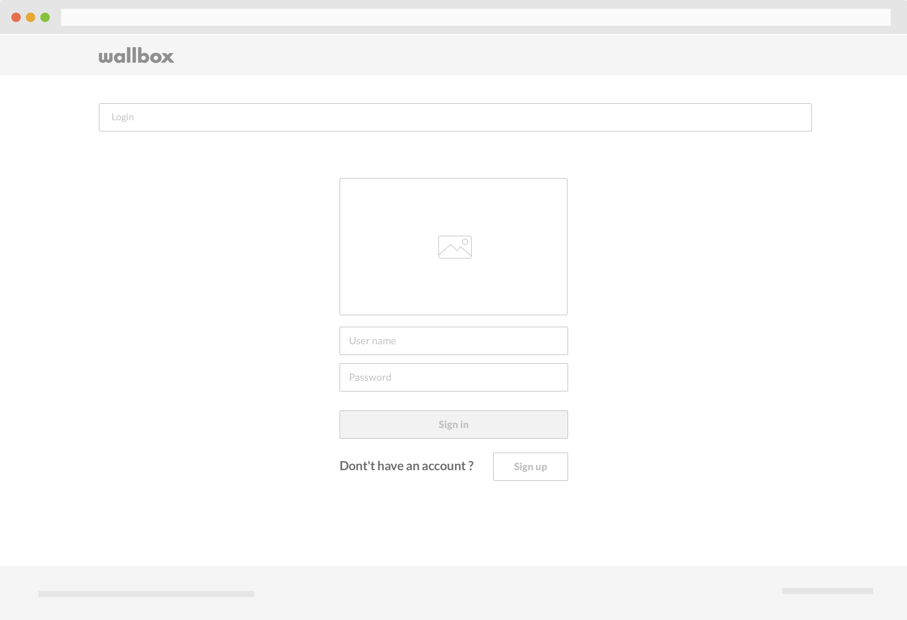
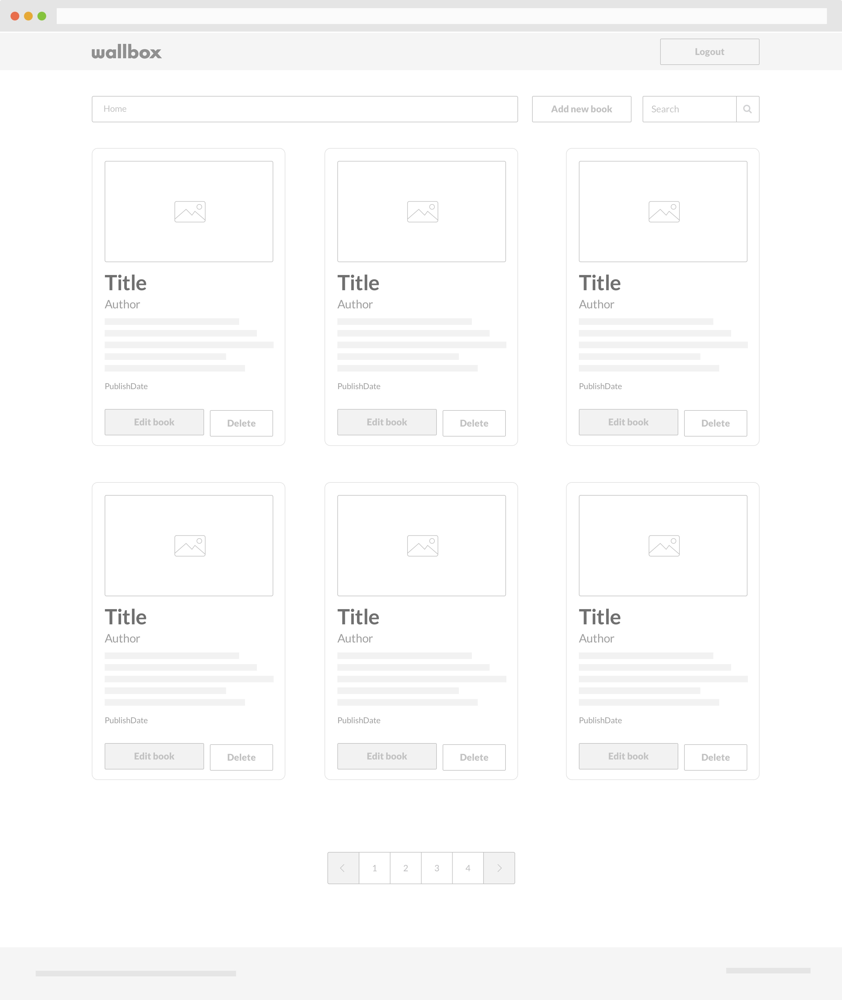
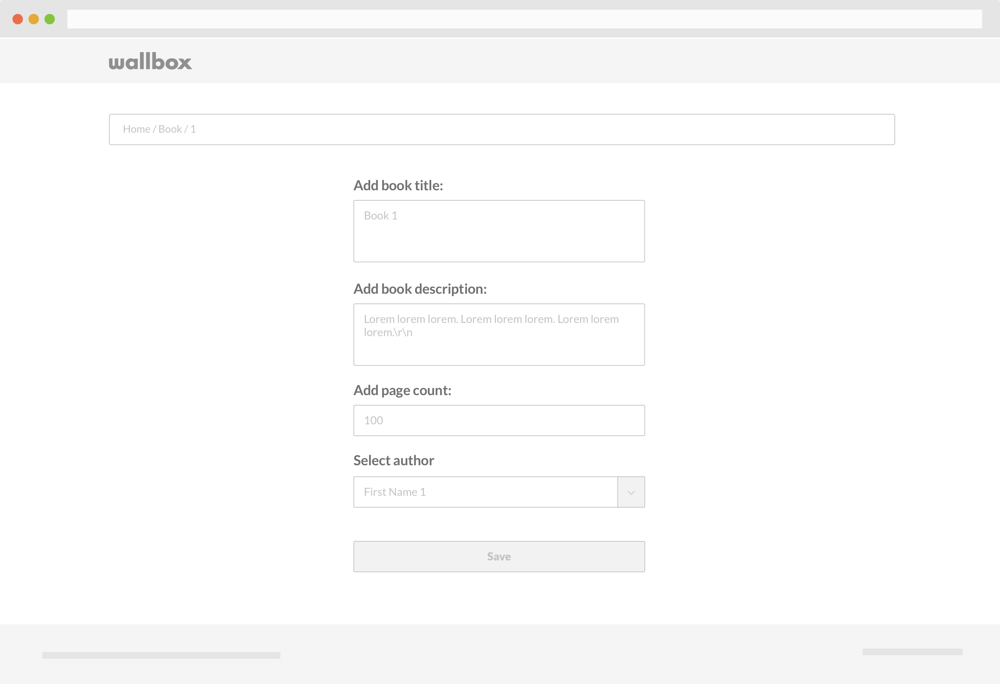

# Knowledge Frontend Test
Welcome to the Wallbox Knowledge Test for Front-end developers!

## Getting started
This test is here to let you show us your amazing front-end engineering skills.
The task? Build interactions and layout of common web-apps using modern front-end technologies. In Wallbox we are working with a progressive javascript framework called Vue.js
The task will be to implement a user access process and a list of books that can be edited or deleted.

## Development
To build the user interface you should use Vue.js framework:

[vue.js](https://vuejs.org/)
 							
Configure your default setup and add all the dependencies that you need.

## Design
The design is important and it's something that we take very seriously at Wallbox.
You have some low-fidelity wireframes in which you can see the layout of the application. You can use a modern UI widget or component toolkits. Feel free to define the look and feel as you see best. We want to see creativity!
Our recommendations are:
* [bulma.io](https://bulma.io)
* [Element](https://element.eleme.io)
* [Materialize](​https://materializecss.com)
* [Semantic UI](https://semantic-ui.com)
* [Vuetify](https://vuetifyjs.com/en)
* [Spectre.css](https://picturepan2.github.io/spectre)

## API
You will use a fake Rest api with sample data for testing your application.

https://fakerestapi.azurewebsites.net/swagger/ui/index

## Minimum Goals
* A finished layout complete with functioning user interactions.
* Create Login and Register page.
* Create List of books.
* Allow Add, Edit, and Delete books.
* Allow to paginate book list.		
* What would you do if you had more time?

## What will we value most?

* The quality of the layout and user interactions.
* Clean code, best practices, and app structure.	
* Adaptive design and the performance of the styles code.
* Data structure, methods, and algorithms.
* Web performance.

## How to submit your test
							
Create a zip file and send it to the email that had this project attached. Please make sure to include all your source files and your git folders with it.

## Wireframes
### Login / Register

### Booklist

### EditBook

